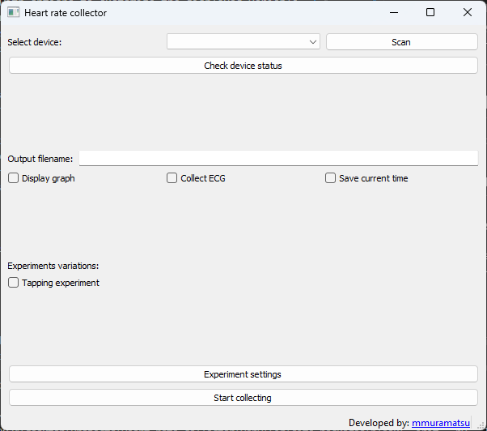

# Heart Rate Collector

This repository contains the source code of a heart rate and ECG collector from a Polar H10 sensor. This application allows users to connect to a Polar H10 device, collect heart rate, RR intervals, and ECG data, visualize the data in real-time, and save it for further analysis.

## Features

*   **Bluetooth Low Energy (BLE) Connectivity:** Scan for and connect to Polar H10 devices.
*   **Real-time Data Collection:** Collect Heart Rate (HR), RR-intervals, and Electrocardiogram (ECG) data.
*   **Real-time Visualization:** Display the collected data in a real-time plot, with options to customize the displayed variable (HR or sdNN), time window, and to show a decision boundary.
*   **Data Processing:** Clean RR-intervals by removing outliers and ectopic beats, and calculate the standard deviation of NN intervals (sdNN).
*   **Experiment Modes:** Includes a "Tapping Experiment" mode to record timestamps of key presses during data collection.
*   **Data Export:** Save the collected data in CSV format for further analysis.
*   **Configuration:** A settings window allows to configure the experiment parameters, which are saved in a `config.json` file.
*   **Cross-Platform:** Built with PyQt5, it should run on Windows, macOS, and Linux.

## Screenshots



## Requirements

### Hardware

*   A Polar H10 heart rate sensor.
*   A computer with Bluetooth Low Energy (BLE) support.

### Software

The application is developed in Python. The following packages are required:

*   `pandas`
*   `numpy`
*   `bleak`
*   `matplotlib`
*   `PyQt5`
*   `pynput`
*   `scikit-learn`
*   `pytest`

## Installation

1.  Clone this repository to your local machine:

    ```bash
    git clone https://github.com/mmuramatsu/Heart-rate-collector.git
    ```

2.  Navigate to the project directory:

    ```bash
    cd Heart-rate-collector
    ```

3.  Install the required dependencies using pip:

    ```bash
    pip install -r requirements.txt
    ```

## Usage

1.  Run the application:

    ```bash
    python app.py
    ```

2.  The main window will appear. Click the "Scan" button to search for Polar devices.

3.  Select your device from the dropdown menu.

4.  Click "Check device status" to get information about the selected device (model, battery, etc.).

5.  Enter a filename for the output files in the "Output filename" field.

6.  Configure the experiment using the "Experiment settings" button. Here you can set parameters for the plot, sdNN calculation, and decision boundaries.

7.  Select the desired options:
    *   **Display graph:** Show a real-time plot of the data.
    *   **Collect ECG:** Collect ECG data in addition to HR and RR.
    *   **Save current time:** Save the system time for each data point.
    *   **Tapping experiment:** Enable the tapping experiment mode.

8.  Click "Start collecting" to begin data collection. A new window will appear showing the collection status and the real-time plot (if enabled).

9.  Click "Stop" to stop the data collection.

## Output Files

The application generates the following output files in the root directory:

*   **`<output_filename>-rr-<timestamp>.csv`:** Contains the collected Heart Rate and RR-interval data.
*   **`<output_filename>-ecg-<timestamp>.csv`:** Contains the collected ECG data (if the "Collect ECG" option was enabled).
*   **`<output_filename>-tapping-<timestamp>.csv`:** Contains the timestamps of the key presses during the tapping experiment (if enabled).
*   **`<output_filename>-graph-<timestamp>.svg`:** Contains a saved image of the plot at the end of the collection (if "Display graph" was enabled).
*   **`config-<timestamp>.csv`:** Contains the configuration used for the experiment.
*   **`config.json`:** Contains the settings from the "Experiment settings" window.

## Contributing

Contributions are welcome! If you have any ideas, suggestions, or bug reports, please open an issue or submit a pull request.

## License

This project is licensed under the MIT License - see the [LICENSE](LICENSE) file for details.